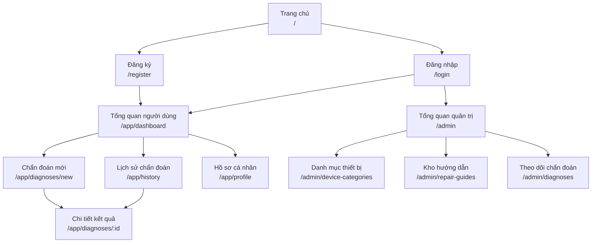
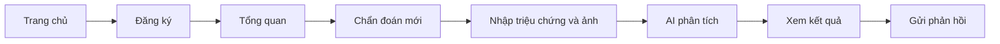
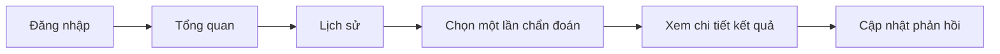
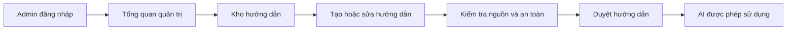

# Sitemap — Nền tảng AI hỗ trợ kiểm tra sự cố đồ gia dụng

**Phiên bản:** 1.0  
**Trạng thái:** MVP dự kiến hoàn thành trong 5 tuần  
**Tên sản phẩm:** Trợ Sửa AI  
**Đối tượng sử dụng:** Người dùng đồ gia dụng và quản trị viên hệ thống

---

## 1. Mục tiêu sản phẩm

Xây dựng một website hỗ trợ người dùng kiểm tra ban đầu sự cố của một số đồ gia dụng thông qua mô tả triệu chứng và hình ảnh. Hệ thống kết hợp kho hướng dẫn sửa chữa với AI để:

- Tóm tắt sự cố.
- Đưa ra các nguyên nhân có thể xảy ra.
- Phân loại mức độ nguy hiểm.
- Đề xuất các bước kiểm tra an toàn.
- Cho biết người dùng có thể tự xử lý hay nên liên hệ kỹ thuật viên.
- Lưu lại lịch sử để người dùng xem lại.

Hệ thống chỉ hỗ trợ kiểm tra ban đầu, không cam kết chẩn đoán chính xác và không thay thế kỹ thuật viên chuyên môn.

---

## 2. Vai trò người dùng

| Vai trò | Mô tả |
|---|---|
| Khách | Người chưa đăng nhập, chỉ được xem trang chủ, đăng ký và đăng nhập |
| Người dùng | Tạo lượt chẩn đoán, xem kết quả, lịch sử và gửi phản hồi |
| Admin | Quản lý danh mục thiết bị, kho hướng dẫn và theo dõi lượt chẩn đoán |

---

## 3. Sơ đồ sitemap tổng thể



---

## 4. Cấu trúc trang và đường dẫn

```text
/
├── /register
├── /login
│
├── /app
│   ├── /dashboard
│   ├── /diagnoses
│   │   ├── /new
│   │   └── /:id
│   ├── /history
│   └── /profile
│
├── /admin
│   ├── /device-categories
│   ├── /repair-guides
│   └── /diagnoses
│
├── /403
├── /404
└── /500
```

---

## 5. Điều hướng chính

### 5.1. Khi chưa đăng nhập

Thanh điều hướng gồm:

- Logo/tên sản phẩm → Trang chủ.
- Cách hoạt động → Cuộn đến khu vực “Cách hoạt động” trên trang chủ.
- An toàn → Cuộn đến khu vực cảnh báo an toàn.
- Đăng nhập.
- Đăng ký.

### 5.2. Khi đăng nhập với vai trò người dùng

Menu người dùng gồm:

- Tổng quan.
- Chẩn đoán mới.
- Lịch sử.
- Hồ sơ cá nhân.
- Đăng xuất.

### 5.3. Khi đăng nhập với vai trò admin

Menu quản trị gồm:

- Tổng quan.
- Danh mục thiết bị.
- Kho hướng dẫn.
- Theo dõi chẩn đoán.
- Quay lại website.
- Đăng xuất.

---

## 6. Đặc tả chi tiết từng trang

## 6.1. Trang chủ

**Đường dẫn:** `/`  
**Quyền truy cập:** Công khai  
**Mục tiêu:** Giải thích website làm gì và hướng người dùng đến đăng ký hoặc chẩn đoán.

### Nội dung chính

1. **Header**
   - Logo và tên sản phẩm.
   - Liên kết “Cách hoạt động”.
   - Liên kết “An toàn”.
   - Nút “Đăng nhập”.
   - Nút “Bắt đầu”.

2. **Hero**
   - Tiêu đề mô tả giá trị chính.
   - Mô tả ngắn về việc nhập triệu chứng, tải ảnh và nhận hướng dẫn.
   - Nút “Bắt đầu kiểm tra”.
   - Dòng lưu ý rằng kết quả chỉ mang tính hỗ trợ ban đầu.

3. **Cách hoạt động**
   - Bước 1: Chọn loại thiết bị.
   - Bước 2: Mô tả triệu chứng và tải ảnh.
   - Bước 3: Nhận kết quả và hướng dẫn an toàn.

4. **Loại thiết bị được hỗ trợ**
   - Quạt điện.
   - Nồi cơm điện.
   - Thiết bị thứ ba chỉ bổ sung khi còn thời gian.

5. **Nguyên tắc an toàn**
   - Luôn ngắt nguồn trước khi kiểm tra.
   - Không tự sửa các vấn đề liên quan đến điện lưới, cháy, gas hoặc pin nguy hiểm.
   - Dừng thao tác khi có mùi khét, tia lửa, dây điện hở hoặc thiết bị quá nóng.

6. **Footer**
   - Giới thiệu dự án.
   - Điều khoản sử dụng cơ bản.
   - Chính sách quyền riêng tư cơ bản.
   - Thông tin nhóm phát triển.

### Hành động chính

- Bắt đầu kiểm tra.
- Đăng ký.
- Đăng nhập.

---

## 6.2. Trang đăng ký

**Đường dẫn:** `/register`  
**Quyền truy cập:** Khách  
**Mục tiêu:** Tạo tài khoản người dùng.

### Trường dữ liệu

- Họ và tên.
- Email.
- Mật khẩu.
- Xác nhận mật khẩu.
- Đồng ý điều khoản sử dụng.

### Quy tắc kiểm tra

- Họ tên không được để trống.
- Email phải đúng định dạng và chưa được sử dụng.
- Mật khẩu phải đạt độ dài tối thiểu.
- Xác nhận mật khẩu phải trùng khớp.
- Không gửi form khi dữ liệu chưa hợp lệ.

### Trạng thái giao diện

- Đang gửi.
- Đăng ký thành công.
- Email đã tồn tại.
- Dữ liệu không hợp lệ.
- Lỗi hệ thống.

### Điều hướng sau thành công

- Chuyển đến `/app/dashboard`.

---

## 6.3. Trang đăng nhập

**Đường dẫn:** `/login`  
**Quyền truy cập:** Khách  
**Mục tiêu:** Xác thực người dùng và điều hướng theo vai trò.

### Trường dữ liệu

- Email.
- Mật khẩu.

### Trạng thái giao diện

- Đang đăng nhập.
- Sai email hoặc mật khẩu.
- Tài khoản không có quyền truy cập.
- Lỗi hệ thống.

### Điều hướng sau thành công

- Người dùng → `/app/dashboard`.
- Admin → `/admin`.

### Ngoài phạm vi MVP

- Đăng nhập bằng Google.
- Đăng nhập bằng Facebook.
- Quên mật khẩu qua email.
- Xác thực hai bước.

---

## 6.4. Trang tổng quan người dùng

**Đường dẫn:** `/app/dashboard`  
**Quyền truy cập:** Người dùng đã đăng nhập  
**Mục tiêu:** Cho người dùng bắt đầu chẩn đoán và xem nhanh hoạt động gần đây.

### Nội dung chính

- Lời chào người dùng.
- Nút “Chẩn đoán mới”.
- Danh sách tối đa 5 lần chẩn đoán gần nhất.
- Tổng số lượt chẩn đoán.
- Số trường hợp đã xử lý được.
- Số trường hợp chưa xử lý được.

### Trạng thái rỗng

Nếu chưa có lịch sử:

- Hiển thị giải thích ngắn.
- Hiển thị nút “Tạo lần chẩn đoán đầu tiên”.

---

## 6.5. Trang chẩn đoán mới

**Đường dẫn:** `/app/diagnoses/new`  
**Quyền truy cập:** Người dùng đã đăng nhập  
**Mục tiêu:** Thu thập đủ thông tin để AI thực hiện kiểm tra ban đầu.

### Trường bắt buộc

- Loại thiết bị.
- Mô tả triệu chứng.
- Xác nhận đã đọc cảnh báo an toàn.

### Trường không bắt buộc

- Hãng sản xuất.
- Model thiết bị.
- Thời điểm bắt đầu xảy ra sự cố.
- Những thao tác người dùng đã thử.
- Từ 1 đến 3 ảnh.

### Quy tắc dữ liệu

- Chỉ chọn danh mục đang được kích hoạt.
- Mô tả triệu chứng phải đạt độ dài tối thiểu.
- Giới hạn độ dài mô tả để tránh nội dung quá lớn.
- Chỉ chấp nhận định dạng ảnh được cho phép.
- Kiểm tra kích thước từng ảnh.
- Không cho phép gửi nhiều hơn số ảnh quy định.

### Các bước giao diện

1. Chọn thiết bị.
2. Nhập thông tin và triệu chứng.
3. Tải ảnh.
4. Đọc cảnh báo và xác nhận.
5. Gửi yêu cầu phân tích.

### Trạng thái xử lý

- Chưa nhập dữ liệu.
- Dữ liệu không hợp lệ.
- Đang tải ảnh.
- Đang phân tích.
- Phân tích thành công.
- AI không phản hồi.
- Kết quả AI không đúng định dạng.
- Không tìm thấy tài liệu phù hợp.
- Lỗi kết nối hoặc lỗi hệ thống.

### Điều hướng sau thành công

- Chuyển đến `/app/diagnoses/:id`.

---

## 6.6. Trang chi tiết kết quả chẩn đoán

**Đường dẫn:** `/app/diagnoses/:id`  
**Quyền truy cập:** Chủ sở hữu kết quả hoặc admin  
**Mục tiêu:** Trình bày kết quả AI theo cấu trúc rõ ràng và an toàn.

### Nội dung chính

1. **Thông tin yêu cầu**
   - Loại thiết bị.
   - Hãng và model nếu có.
   - Triệu chứng người dùng nhập.
   - Ảnh đã tải lên.
   - Thời gian thực hiện.

2. **Tóm tắt sự cố**
   - Diễn giải ngắn, dễ hiểu.

3. **Nguyên nhân có thể xảy ra**
   - Danh sách nguyên nhân.
   - Không hiển thị phần trăm chính xác nếu hệ thống chưa có dữ liệu kiểm chứng.

4. **Mức độ nguy hiểm**
   - Thấp.
   - Trung bình.
   - Cao.

5. **Các bước kiểm tra an toàn**
   - Các bước theo thứ tự.
   - Chỉ hiển thị thao tác phù hợp với mức độ rủi ro.

6. **Dấu hiệu phải dừng**
   - Mùi khét.
   - Tia lửa.
   - Dây điện hở.
   - Rò điện.
   - Thiết bị quá nóng.
   - Dấu hiệu nguy hiểm khác từ kho quy tắc.

7. **Khuyến nghị cuối cùng**
   - Có thể tự thực hiện bước kiểm tra cơ bản.
   - Không nên tự sửa.
   - Nên mang đến cửa hàng hoặc liên hệ kỹ thuật viên.

8. **Nguồn tham khảo**
   - Tên tài liệu hoặc hướng dẫn đã được hệ thống sử dụng.
   - Không để AI tự tạo nguồn không tồn tại.

9. **Phản hồi của người dùng**
   - Đã xử lý được.
   - Chưa xử lý được.
   - Chưa thử.
   - Ghi chú ngắn không bắt buộc.

### Quy tắc an toàn

- Với mức nguy hiểm cao, ẩn hướng dẫn tự sửa chi tiết.
- Luôn hiển thị cảnh báo nổi bật trước các bước xử lý.
- Backend phải kiểm tra lại kết quả AI trước khi lưu và hiển thị.
- Không hiển thị trực tiếp dữ liệu thô do AI trả về.

---

## 6.7. Trang lịch sử chẩn đoán

**Đường dẫn:** `/app/history`  
**Quyền truy cập:** Người dùng đã đăng nhập  
**Mục tiêu:** Giúp người dùng tìm và xem lại các lần chẩn đoán.

### Thông tin mỗi mục

- Loại thiết bị.
- Hãng hoặc model nếu có.
- Tóm tắt triệu chứng.
- Ngày thực hiện.
- Mức độ nguy hiểm.
- Trạng thái phản hồi.

### Chức năng

- Mở chi tiết kết quả.
- Lọc theo loại thiết bị.
- Lọc theo trạng thái đã xử lý/chưa xử lý.
- Sắp xếp mới nhất trước.

### Phân trang

- Có thể sử dụng phân trang đơn giản nếu dữ liệu vượt quá số lượng hiển thị.

### Trạng thái rỗng

- Thông báo chưa có lịch sử.
- Nút “Chẩn đoán mới”.

---

## 6.8. Trang hồ sơ cá nhân

**Đường dẫn:** `/app/profile`  
**Quyền truy cập:** Người dùng đã đăng nhập  
**Mục tiêu:** Quản lý thông tin tài khoản cơ bản.

### Chức năng

- Xem email.
- Cập nhật họ tên.
- Đổi mật khẩu.
- Đăng xuất.

### Ngoài phạm vi MVP

- Ảnh đại diện.
- Xóa tài khoản tự động.
- Quản lý nhiều địa chỉ.
- Cài đặt thông báo.

---

## 6.9. Trang tổng quan quản trị

**Đường dẫn:** `/admin`  
**Quyền truy cập:** Admin  
**Mục tiêu:** Theo dõi tình trạng dữ liệu và hoạt động của hệ thống.

### Thông tin tổng quan

- Tổng số danh mục thiết bị.
- Tổng số hướng dẫn sửa chữa.
- Tổng số lượt chẩn đoán.
- Số lượt chẩn đoán theo mức nguy hiểm.
- Số phản hồi đã xử lý được/chưa xử lý được.

### Hành động nhanh

- Thêm danh mục thiết bị.
- Thêm hướng dẫn sửa chữa.
- Xem các lượt chẩn đoán gần nhất.

---

## 6.10. Trang quản lý danh mục thiết bị

**Đường dẫn:** `/admin/device-categories`  
**Quyền truy cập:** Admin  
**Mục tiêu:** Quản lý các loại thiết bị mà website hỗ trợ.

### Thông tin danh mục

- Tên danh mục.
- Mô tả.
- Trạng thái hoạt động.
- Số hướng dẫn liên quan.
- Ngày cập nhật.

### Chức năng

- Thêm danh mục.
- Sửa danh mục.
- Kích hoạt hoặc ẩn danh mục.
- Tìm kiếm theo tên.
- Xóa danh mục khi chưa có dữ liệu liên quan.

### Quy tắc

- Không cho xóa danh mục đang được hướng dẫn hoặc lượt chẩn đoán sử dụng.
- Ưu tiên chuyển trạng thái sang “Không hoạt động” thay vì xóa dữ liệu.

---

## 6.11. Trang quản lý kho hướng dẫn

**Đường dẫn:** `/admin/repair-guides`  
**Quyền truy cập:** Admin  
**Mục tiêu:** Quản lý dữ liệu sửa chữa được hệ thống dùng làm căn cứ cho AI.

### Thông tin mỗi hướng dẫn

- Tiêu đề.
- Loại thiết bị.
- Triệu chứng liên quan.
- Nguyên nhân thường gặp.
- Mức độ nguy hiểm.
- Các bước kiểm tra an toàn.
- Các dấu hiệu phải dừng.
- Khuyến nghị liên hệ kỹ thuật viên.
- Nguồn tài liệu.
- Trạng thái bản nháp/đã duyệt.
- Ngày cập nhật.

### Chức năng

- Thêm hướng dẫn.
- Sửa hướng dẫn.
- Xem chi tiết.
- Chuyển trạng thái bản nháp/đã duyệt.
- Tìm kiếm và lọc theo loại thiết bị.
- Ẩn hướng dẫn không còn phù hợp.

### Quy tắc

- AI chỉ được sử dụng các hướng dẫn đã duyệt.
- Nguồn tài liệu không được để trống khi xuất bản.
- Hướng dẫn mức nguy hiểm cao không được chứa các bước tự sửa chi tiết.

---

## 6.12. Trang theo dõi lượt chẩn đoán

**Đường dẫn:** `/admin/diagnoses`  
**Quyền truy cập:** Admin  
**Mục tiêu:** Theo dõi chất lượng kết quả AI và phản hồi của người dùng.

### Thông tin hiển thị

- Mã lượt chẩn đoán.
- Loại thiết bị.
- Tóm tắt triệu chứng.
- Mức độ nguy hiểm.
- Kết quả phản hồi.
- Thời gian thực hiện.

### Chức năng MVP

- Xem danh sách.
- Xem chi tiết.
- Lọc theo loại thiết bị.
- Lọc theo mức độ nguy hiểm.
- Lọc theo phản hồi.
- Sắp xếp mới nhất trước.

### Giới hạn quyền riêng tư

- Không hiển thị mật khẩu hoặc dữ liệu xác thực.
- Chỉ hiển thị thông tin người dùng cần thiết cho việc kiểm tra hệ thống.
- Không sử dụng ảnh người dùng để huấn luyện nếu chưa có sự đồng ý.

---

## 6.13. Các trang trạng thái hệ thống

### Không có quyền truy cập

**Đường dẫn:** `/403`

- Thông báo người dùng không có quyền mở trang.
- Liên kết quay về trang phù hợp với vai trò.

### Không tìm thấy

**Đường dẫn:** `/404`

- Thông báo đường dẫn không tồn tại.
- Nút quay về trang chủ.

### Lỗi hệ thống

**Đường dẫn:** `/500`

- Thông báo hệ thống đang gặp lỗi.
- Nút thử lại.
- Nút quay về trang chủ.

---

## 7. Các luồng sử dụng chính

## 7.1. Luồng đăng ký và chẩn đoán lần đầu



## 7.2. Luồng xem lại lịch sử



## 7.3. Luồng quản lý kho hướng dẫn



---

## 8. Ma trận quyền truy cập

| Trang/chức năng | Khách | Người dùng | Admin |
|---|:---:|:---:|:---:|
| Trang chủ | Có | Có | Có |
| Đăng ký | Có | Không cần | Không cần |
| Đăng nhập | Có | Không cần | Không cần |
| Tổng quan người dùng | Không | Có | Không |
| Chẩn đoán mới | Không | Có | Không |
| Xem kết quả của chính mình | Không | Có | Có |
| Lịch sử cá nhân | Không | Có | Không |
| Hồ sơ cá nhân | Không | Có | Có |
| Tổng quan quản trị | Không | Không | Có |
| Quản lý danh mục | Không | Không | Có |
| Quản lý hướng dẫn | Không | Không | Có |
| Theo dõi chẩn đoán | Không | Không | Có |

---

## 9. Phạm vi MVP trong 5 tuần

### Bắt buộc hoàn thành

- Trang chủ responsive.
- Đăng ký, đăng nhập và đăng xuất.
- Phân quyền người dùng/admin.
- Form chẩn đoán với mô tả và ảnh.
- Backend gọi AI và kiểm tra dữ liệu trả về.
- Kết quả có mức độ nguy hiểm và cảnh báo an toàn.
- Lưu kết quả vào database.
- Lịch sử và chi tiết chẩn đoán.
- Phản hồi đã xử lý được/chưa xử lý được.
- Admin quản lý danh mục thiết bị.
- Admin quản lý kho hướng dẫn.
- Admin xem lượt chẩn đoán.
- Xử lý loading, dữ liệu rỗng và lỗi.
- Deploy website và cung cấp tài khoản demo.

### Chỉ làm nếu còn thời gian

- Lọc và phân trang nâng cao.
- Dashboard có biểu đồ.
- Email xác nhận đăng ký.
- Thêm loại thiết bị thứ ba.
- Cho người dùng lưu thiết bị thường dùng.

### Không thuộc MVP

- Phân tích video đầy đủ.
- Nhận dạng âm thanh thiết bị.
- Tự huấn luyện hoặc fine-tune mô hình.
- Đặt lịch với kỹ thuật viên.
- Thanh toán.
- Chat trực tiếp.
- Cộng đồng hỏi đáp.
- So sánh giá linh kiện.
- Ứng dụng di động.

---

## 10. Quy ước sitemap

- Một trang tương ứng với một mục tiêu chính.
- Modal, toast, nút bấm và trạng thái loading không được tính là trang độc lập.
- Các trang `/app/*` yêu cầu đăng nhập.
- Các trang `/admin/*` yêu cầu vai trò admin.
- Người dùng chỉ được xem kết quả thuộc tài khoản của mình.
- Mọi trang đều phải có đường điều hướng quay về khu vực phù hợp.
- Những tính năng ngoài MVP không được thêm vào sitemap chính trong giai đoạn 5 tuần.

---

## 11. Tiêu chí chốt sitemap

Sitemap được xem là hoàn thành khi:

- Mỗi chức năng bắt buộc của MVP đã có trang chứa nó.
- Không có trang nào chưa xác định mục tiêu.
- Đường đi từ đăng ký đến nhận kết quả không bị gián đoạn.
- Người dùng có thể quay lại xem kết quả cũ.
- Admin có đủ trang để quản lý dữ liệu mà AI sử dụng.
- Quyền truy cập giữa khách, người dùng và admin được phân biệt rõ.
- Các chức năng ngoài phạm vi đã được ghi riêng và không ảnh hưởng tiến độ MVP.
